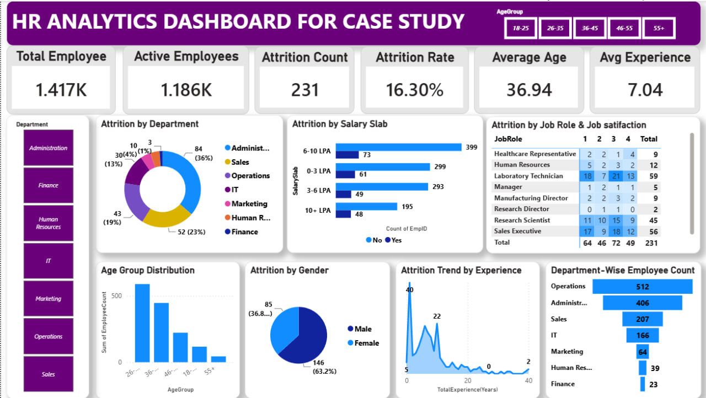

# HR Analytics Dashboard for Case Study

An interactive Power BI dashboard that transforms raw employee data into actionable HR insights — covering workforce demographics, attrition trends, salary distribution, and experience patterns to support better people-management decisions.

---

## 📌 Project Overview

Employee attrition is one of the most critical challenges HR teams face. This project analyzes a company's employee dataset to uncover **why, where, and who** is leaving the organization — and turns those patterns into a single-page, decision-ready dashboard.

The dashboard helps HR and business leaders answer questions like:
- Which departments and job roles have the highest attrition?
- Is attrition linked to salary level or job satisfaction?
- Are certain age groups or experience levels more likely to leave?
- Is there a gender gap in attrition?
- How is the workforce distributed across departments?

---

## 📊 Dataset Introduction

The dataset contains **employee-level records with 1,480 rows and 37 columns** of structured HR data.

**Key columns used in the analysis:**

| Column | Description |
|---|---|
| `EmpID` | Unique identifier for each employee |
| `Age`, `AgeGroup` | Used to analyze workforce demographics |
| `Department`, `JobRole` | Helps understand organizational workforce structure |
| `MonthlyIncome`, `SalarySlab` | Used to analyze salary distribution |
| `Attrition` | Indicates whether an employee has left the company or is still active |
| `JobSatisfaction` | Helps measure employee engagement levels |
| `TotalExperience(Years)`, `YearsatCompany` | Used to analyze employee career progression |
| `Gender` | Used to analyze attrition patterns by gender |

Other supporting fields include `BusinessTravel`, `Education`, `EducationField`, `JobLevel`, `MaritalStatus`, `OverTime`, `PerformanceRating`, `WorkLifeBalance`, `YearsInCurrentRole`, `YearsSincePromotion`, and `YearsWithCurrManager`.

This dataset is used to build an interactive dashboard that provides insights into **employee attrition, workforce distribution, and experience trends** — helping organizations make better, data-driven HR decisions.

---

## 🛠️ Tools Used

- **Power BI Desktop** — dashboard development
- **Power Query Editor** — data cleaning and transformation
- **DAX** — KPI and measure calculations

---

## 🔄 Data Preparation (Power Query)

Before loading the dataset into the Power BI data model, it was cleaned and transformed using the Power Query Editor:

- **Checked for unnecessary columns**, including columns with null values, and removed those not required for analysis
- **Removed duplicate records** to ensure data accuracy
- **Replaced inconsistent or incorrect values** to standardize the dataset
- **Verified and corrected data types** (text, numeric, date, categorical) for each column to ensure proper aggregation and visualization behavior

This step ensured the dataset was clean, consistent, and analysis-ready before being loaded into the Power BI data model.

---

## 📈 Dashboard Design

### KPI Cards

A set of summary cards at the top of the dashboard gives an at-a-glance view of overall workforce health:

| KPI | Description |
|---|---|
| **Total Employee** | Total number of employees in the dataset (1.417K) |
| **Active Employees** | Number of employees currently active in the company (1.186K) |
| **Attrition Count** | Total number of employees who have left the company (231) |
| **Attrition Rate** | Percentage of employees who left, relative to total employees (16.30%) |
| **Average Age** | Average age of all employees (36.94) |
| **Avg Experience** | Average total years of work experience across employees (7.04) |

### Filter / Slicer

- **AgeGroup slicer** (18-25, 26-35, 36-45, 46-55, 55+) — allows dynamic filtering of the entire dashboard by employee age bracket
- **Department navigation buttons** — allows quick filtering by department (Administration, Finance, Human Resources, IT, Marketing, Operations, Sales)

---

## 📉 Chart Visuals & Insights

### 1. Attrition by Department
A donut chart showing overall attrition broken down by department. It helps quickly identify which departments struggle the most with retention.
- **Insight:** Administration has the highest attrition at around **36%**, followed by Sales (23%) and Operations (19%).

### 2. Attrition by Salary Slab
A bar chart comparing attrition against active employees across salary bands (0-3 LPA, 3-6 LPA, 6-10 LPA, 10+ LPA).
- **Insight:** In the 6–10 LPA slab, there are around **399 active employees vs. 73 who left** — this helps HR understand how attrition is distributed across pay grades and identify which salary groups have the highest turnover.

### 3. Attrition by Job Role & Job Satisfaction
A matrix visual cross-referencing job role against job satisfaction levels (1–4 scale).
- **Insight:** Provides deeper visibility into which job roles have higher attrition and how satisfaction levels correlate with employees leaving — e.g., Laboratory Technician and Sales Executive show the highest total counts across satisfaction bands.

### 4. Age Group Distribution
A column chart showing the number of employees in each age bracket.
- **Insight:** Gives a clear view of overall workforce demographic structure, useful for planning age-based HR strategies (e.g., succession planning, mentorship programs).

### 5. Attrition by Gender
A pie chart comparing attrition between male and female employees.
- **Insight:** Male employees account for **63.2%** of attrition (146) versus **36.8%** (85) for female employees — helping compare which group experiences higher turnover.

### 6. Attrition Trend by Experience
A line/area chart tracking attrition across total years of experience.
- **Insight:** Helps identify whether employees are leaving more at early-career, mid-career, or senior experience stages — attrition is notably concentrated among lower-experience employees.

### 7. Department-Wise Employee Count
A bar chart showing total headcount by department.
- **Insight:** Operations (512) and Administration (406) have the largest workforce, while Human Resources (39) and Finance (23) are the smallest — giving a quick view of department strength and staffing balance.

---

## 💡 Key Takeaway

This HR Analytics dashboard demonstrates how raw employee data can be turned into meaningful business insights. By combining KPI tracking, departmental analysis, salary and satisfaction breakdowns, and demographic trends, HR teams can:

- Pinpoint high-risk departments and job roles for targeted retention efforts
- Understand the relationship between pay, satisfaction, and attrition
- Make informed, data-driven decisions to improve employee retention and workforce planning

---

## 📁 Files

| File | Description |
|---|---|
| `HR_Analytics-4.csv` | Raw employee dataset (1,480 rows × 37 columns) |
| `HR Analytics Dashboard.pbix` | Power BI dashboard file |
| `README.md` | Project documentation (this file) |

---

## 🚀 How to Use

1. Open `HR Analytics Dashboard.pbix` in Power BI Desktop
2. Use the **AgeGroup slicer** and **Department buttons** to filter the dashboard interactively
3. Hover over any chart to view detailed tooltips
4. Explore the **Job Role & Job Satisfaction matrix** to drill into specific attrition drivers
